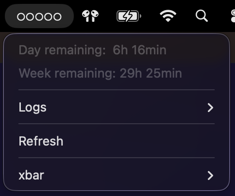
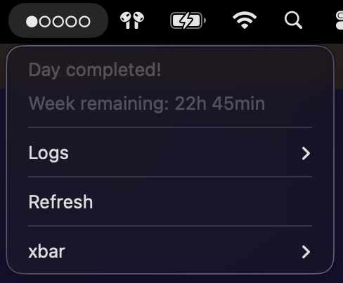

# Timr - Time Tracking System

A lightweight time-tracking system for macOS that automatically logs work hours and displays progress in the menu bar.

## Screenshots



*Timr showing daily and weekly progress in the menu bar*



*Timr showing one fifth of hours completed*

## Dependencies

Timr requires these dependencies that will request installation during setup:
- **xbar** - For menu bar display
- **sleepwatcher** - For sleep/wake tracking

## Installation

Run the install script - it will check for any missing dependencies:

```bash
./timr_install.sh
```

The installer will:
1. Check for required dependencies (xbar, sleepwatcher)
2. Offer to install them automatically via Homebrew if missing
3. Install the xbar menu bar plugin

After installation, log in (or sleep/wake) to start tracking time.

## What it does

- Automatically tracks time across login, wake, sleep, logout, and shutdown
- Shows progress in your menu bar with visual indicators
- Configurable weekly hour target and number of work days, set directly from the Timr dropdown
- Manual Pause / Resume from the menu, with an activity-aware reminder if you forget to resume
- Click the menu bar item to access your time logs

### How sessions are captured

| Event              | How it's captured                                    |
|--------------------|------------------------------------------------------|
| Boot / login       | Login LaunchAgent runs the start script at load     |
| Wake               | `sleepwatcher -w` runs the start script             |
| Sleep              | `sleepwatcher -s` runs the stop script              |
| Logout / shutdown  | Persistent agent traps SIGTERM and runs the stop script |
| Manual pause       | Menu → Pause timer (survives sleep/wake)             |
| Manual resume      | Menu → Resume timer (or via the reminder dialog)     |

Hard power-off and kernel panics cannot be caught — in those cases the in-flight session is lost, but future sessions recover cleanly on next boot.

### Configuring targets

Open the Timr menu bar icon → **Settings** → **Weekly hours** or **Days per week**. Presets are available for common values, plus a **Custom...** option that opens a dialog for any number (decimal hours like `37.5` are fine). Changes take effect on the next 30-second refresh. Values are stored at `~/Library/Application Support/timr/config`.

### Pause / Resume

Click **Pause timer** in the dropdown to freeze time tracking without having to sleep the Mac — the current session is committed to the log immediately, and a pause flag is raised. When paused:

- The menu-bar icon shows a `⏸` prefix and `Status: Paused` appears at the top of the dropdown.
- Closing the lid or logging out does not silently resume — the start script honours the pause flag on wake/login.
- If you've been paused for more than a minute and Timr detects recent mouse/keyboard activity, it will prompt you with a dialog asking whether to resume. The prompt is rate-limited to once every 5 minutes so it never spams.

Click **Resume timer** (or use the dialog's Resume button) to start a fresh session.

### Session log format

`~/Library/Logs/timr/sessions.log` records every state change using the format:

```
2026-04-10 09:00:00 START login username
2026-04-10 12:30:00 STOP sleep username (Session: 12600 seconds)
2026-04-10 13:15:00 START wake username
2026-04-10 17:00:00 STOP pause username (Session: 13500 seconds)
2026-04-10 17:05:00 START resume username
2026-04-10 17:45:00 STOP shutdown username (Session: 2400 seconds)
```

The reason field (`login`, `wake`, `sleep`, `shutdown`, `pause`, `resume`) explains which trigger caused the state change. `~/Library/Logs/timr/developer.log` holds the aggregated per-day totals in seconds and is what the menu-bar display reads from.

## Uninstall

```bash
./timr_uninstall.sh
```